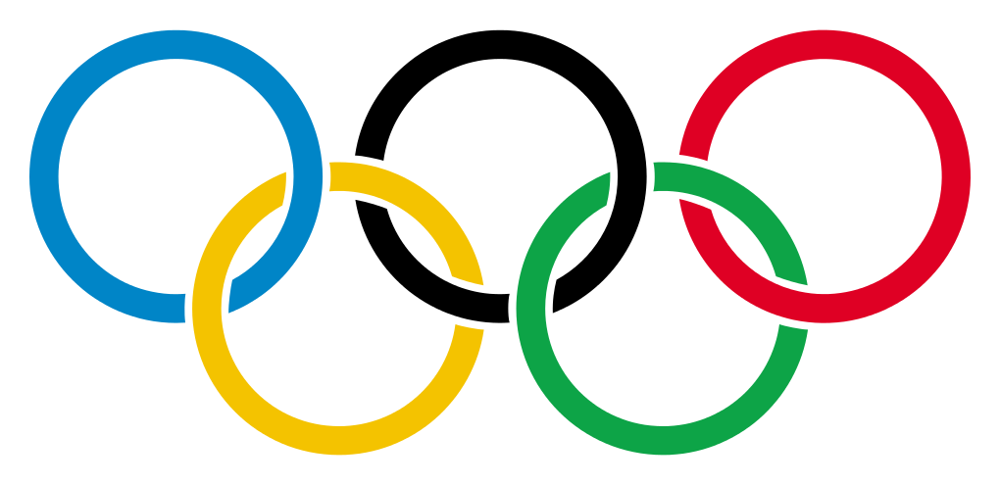

# 
 OLIMPÍADAS

 

Repositório destinado à documentação do projeto de Interação Humano-Computador, da Universidade de Brasília, Campus do Gama.

 
 
## Equipe

<figure style="float:left;margin-right:16px;">
  
  <figcaption align="center">Dafne Moretti</figcaption>
</figure>

<figure style="float:left;margin-right:16px;">
  
  <figcaption align="center">Thiago França</figcaption>
</figure>

<figure style="float:left;margin-right:16px;">
  
  <figcaption align="center">Peniel Zannoukou</figcaption>
</figure>

<figure style="float:left;margin-right:16px;">
  
  <figcaption align="center">João Pedro</figcaption>
</figure>

<figure style="float:left;margin-right:16px;">
  
  <figcaption align="center">Lucas Andrade</figcaption>
</figure>

<figure style="float:left;margin-right:16px;">
  
  <figcaption align="center">Gabriel Costa</figcaption>
</figure>

 
