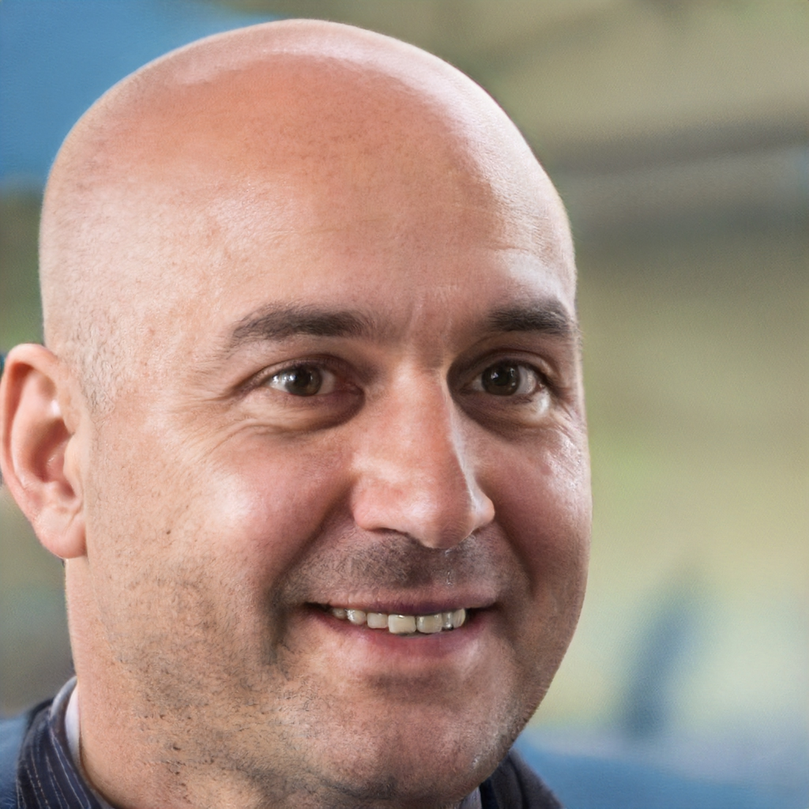
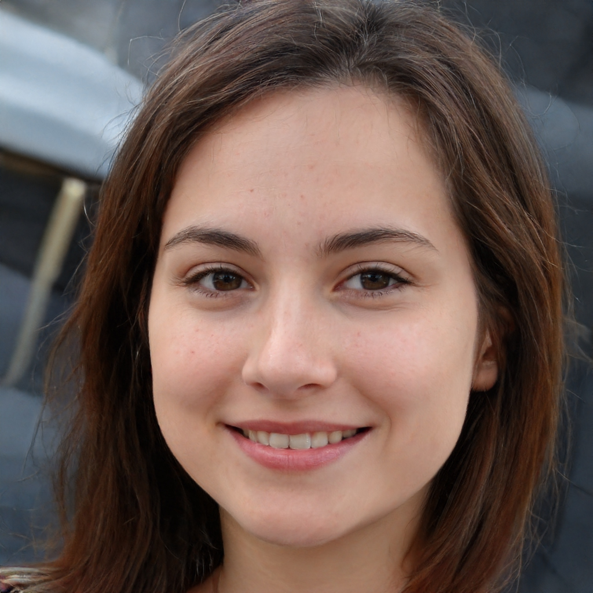

# 
 TEMPLATE

### Histórico de versão 

|Data | Versão | Descrição | Autor(es)|
| -- | -- | -- | -- |
| 01.12.2020 | 0.1 | Criação do documento | Lucas Andrade Dafne Moretti|
| 01.12.2020 | 0.2 | Criação das personas | Thiago França|

### Participantes

* Thiago França

  

### Introdução

 
Esse documento tem como principal objetivo definir as personas do projeto Olympic News. Com o intuito de entender quem são os usuários e quais são seus interesses no projeto, para então ter noção quais são suas principais necessidades dentro da aplicação.

   As personas são essencias para a coleta de dados possibilitando que sejam traçados pontos comuns dos usuários da aplicação, por isso é importante que as personas sejam criadas se baseando em usuários reais, assim o projeto pode ser desenvolvido de forma que se adapte a eles.

  

 

### Metodologia

 
As personas foram traçadas pensando em usuários reais e suas jornadas diárias, permitindo que fossem identificadas as situações e que a aplicação seria útil e quais funcionalidades seriam interessantes para tais situações.

 

### Resultados
### 
Persona 1

#### Nome: Germano Conceição da Cruz
#### Idade: 38 anos
#### Ocupação: Engenheiro eletricista
#### Tarefas: Germano é um dos engenheiros mais experientes da sua empresa, então é sempre sobrecarregado de tarefas que diárias no trabalho. Além de trabalhar, Germano estuda todos os dias para que em breve assuma um cargo gerencial na empresa em que trabalha.   
#### Requisitos: Germano é muito ocupado no seu dia a dia então não tem tempo de assistir aos jogos. Para ele o mais importante é receber as notícias para saber como seu país está se saindo, além de ser notificado de quando os eventos de seus esportes favoritos estiverem acontecendo, para dar uma espiada no acompanhamenteo em tempo real enquanto realiza suas tarefas diárias.

### 
Persona 2

#### Nome: Ana Isabel Borba Linhaes
#### Idade: 29 anos
#### Ocupação: Atendente de joalheria
#### Tarefas: Ana Trabalha todo dia atendendo os clientes da joalheria de sua mãe, por ser uma loja para clientes das classes mais altas, o intervalo entre os atendimentos de Ana custuma a ser de vários minutos. Ao sair do trabalho Ana estuda para poder um dia abrir sua própria joalheria. 
#### Requisitos: Por ter um bom tempo livre no trabalho, Ana acaba utilizando muito seu celular. Ela quer estar completamente informada de tudo que está acontecendo nos jogos para não perder uma medalha. O mais importante para ela é poder checar o quadro de medalhas para ter certeza de que não perdeu nenhuma enquanto atendia alguém e caso tenha perdido, ela quer saber quem ganhou aquela medalha e como.

### 
Persona 3

#### Nome: Penélope Reis da Silva
#### Idade: 21 anos
#### Ocupação: Estudante Universitária
#### Tarefas: Penélope tem aulas durante o período da manhã, durante a tarde ela estuda para suas provas e a noite gosta de sair com seus amigos.
#### Requisitos: Por ainda não trabalhar, quando não está no período do provas Penélope acaba tendo muito tempo livre após as aulas. Ela gosta de assistir aos jogos olímpicos pela televisão. Para ela o mais importante é saber o horário dos jogos da sua delegação e onde será possível assistí-los, além de poder acompanhar em tempo real outros eventos que estejam acontecendo ao mesmo tempo daquele que ela está acompanhando para não precisar trocar constantemente de canal.

## Referências
