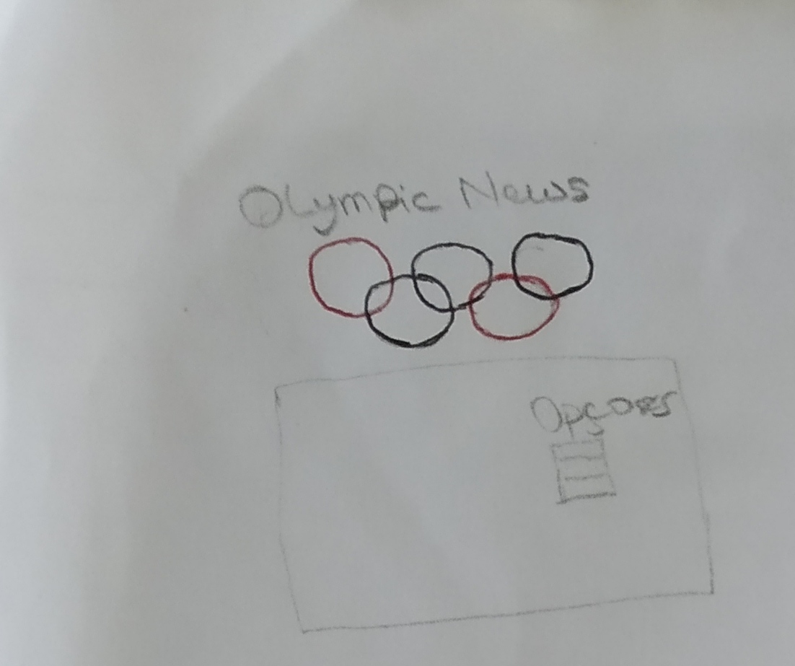
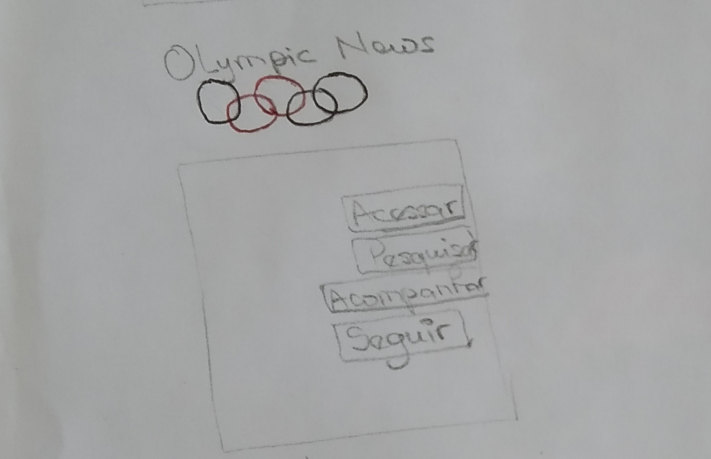
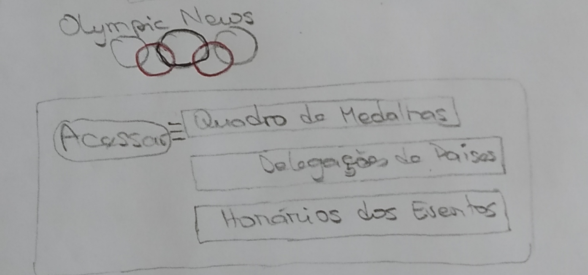
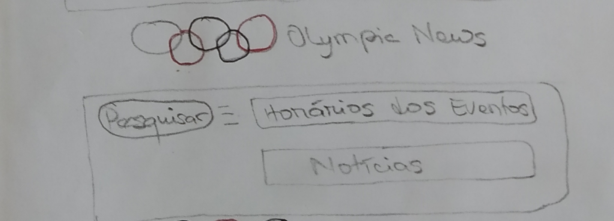
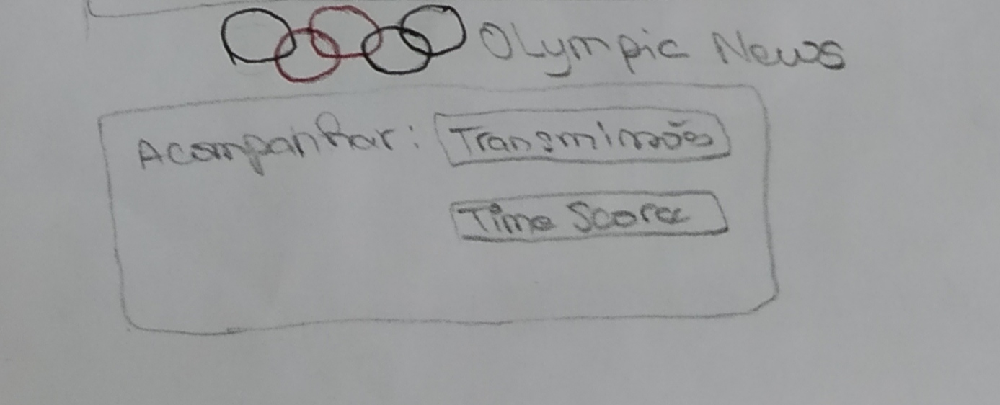
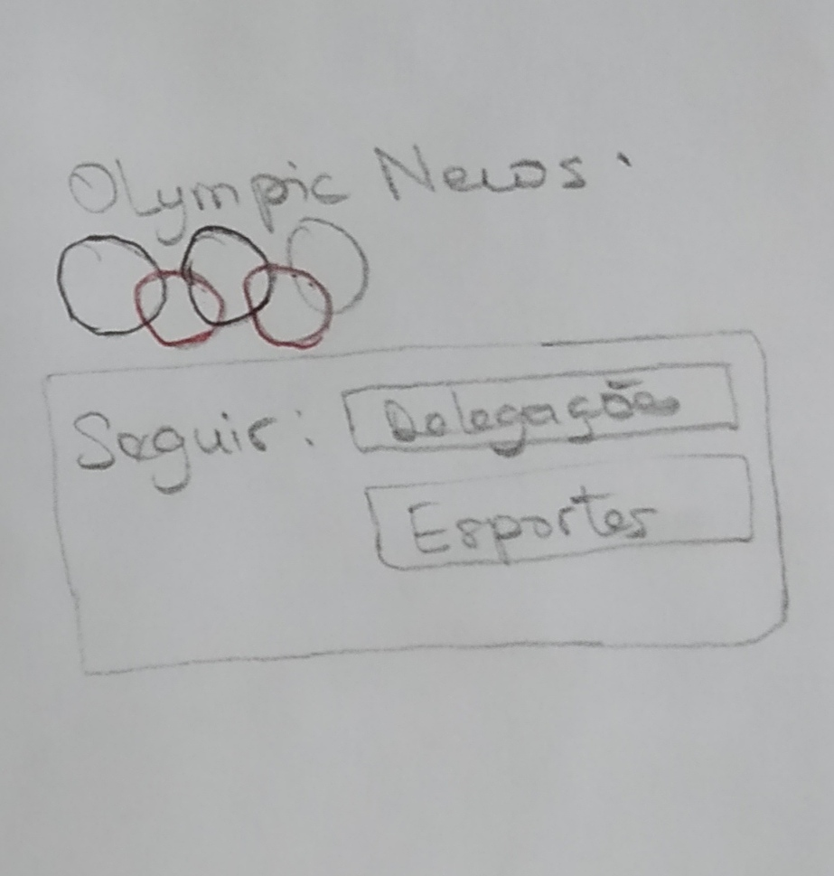

# 
 PROTÓTIPO DE BAIXA-FIDELIDADE

### Histórico de versão 

|Data | Versão | Descrição | Autor(es)|
| -- | -- | -- | -- |
| 29.08.2021 | 0.1 | Criação do documento | Peniel Zannoukou|

### Participantes

* Peniel Zannoukou

  

### Metodologia

&emsp;&emsp; O objetivo da criação do protótipo de baixa fidelidade é a apresentação das telas e elementos de uma forma não tão próxima com o produto final. Essa prática permite a discussão sobre detalhes mais superficiais no momento das tomadas de decisão a respeito do design do software e a identificação de possíveis problemas de usabilidade e requisitos. 

 

&emsp;&emsp; A criação do protótipo de baixa fidelidade foi realizada em papel devido a facilidade na criação de esboços. O protótipo tem como objetivo abranger pontos iniciais da interface do produto em termos visuais e estéticos, e os aspectos básicos da experiência do usuário. 

 

### Protótipo de Baixa Fidelidade

 

 Figura 1 - 1ª folha do protótipo de papel  

 

 Figura 2 - 2ª folha do protótipo de papel  

 

 Figura 3 - 3ª folha do protótipo de papel  

 

 Figura 4 - 4ª folha do protótipo de papel  

 

 Figura 5 - 5ª folha do protótipo de papel  

 

 Figura 6 - 6ª folha do protótipo de papel  

### Referências
> Massachussets Institute of Tecnology - MIT. User Interface Design & Implementation: Prototyping.  Poderíam acessar clicando <a href="http://web.mit.edu/6.813/www/sp17/classes/08-prototyping/">aqui</a>
 Foi acessado no dia 29 de Agosto de 2021